# 파이널 프로젝트

### 소비자를 위한 농산물 가격 종합 AI 시스템

- 소비자들에게 농산물 가격을 알려주기 위해 만든 가격 종합 AI사이트이다.

- 위 주소에 들어가면 우리 팀이 만든 다양한 기능들을 경험할 수 있다.

#### 우리동네 채소가격

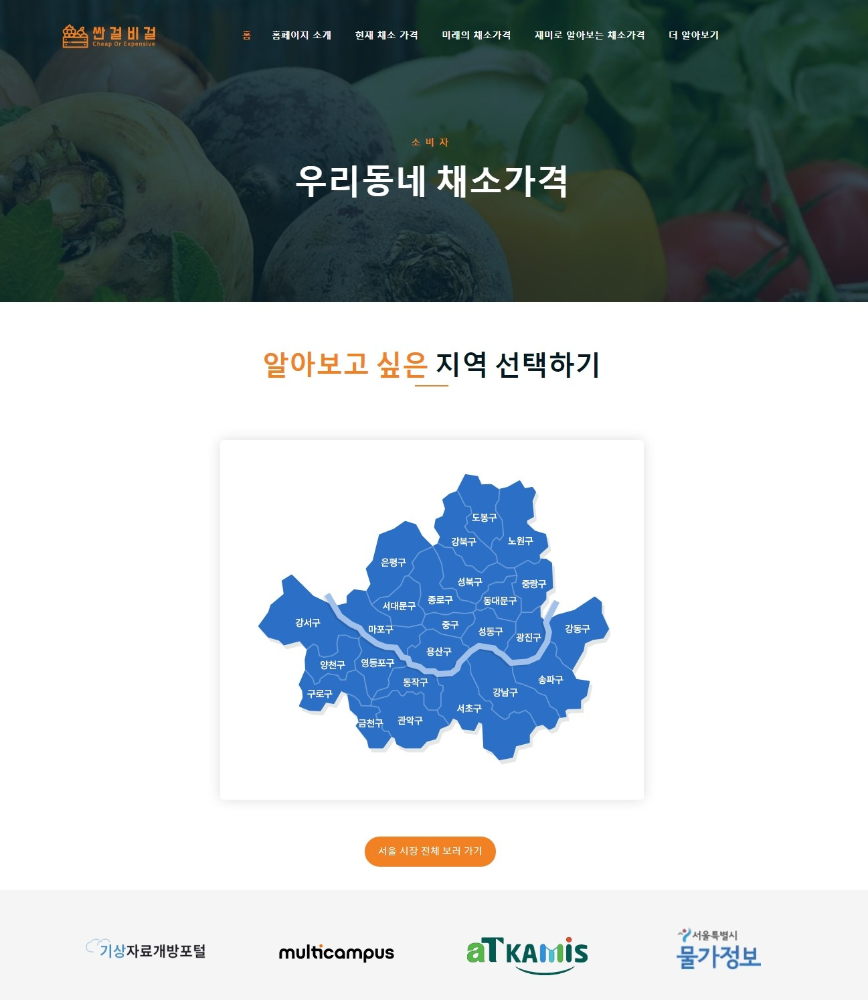

- https://www.image-map.net/ 이 사이트에서 지도의 모든 영역을 잡아주었다.
  - 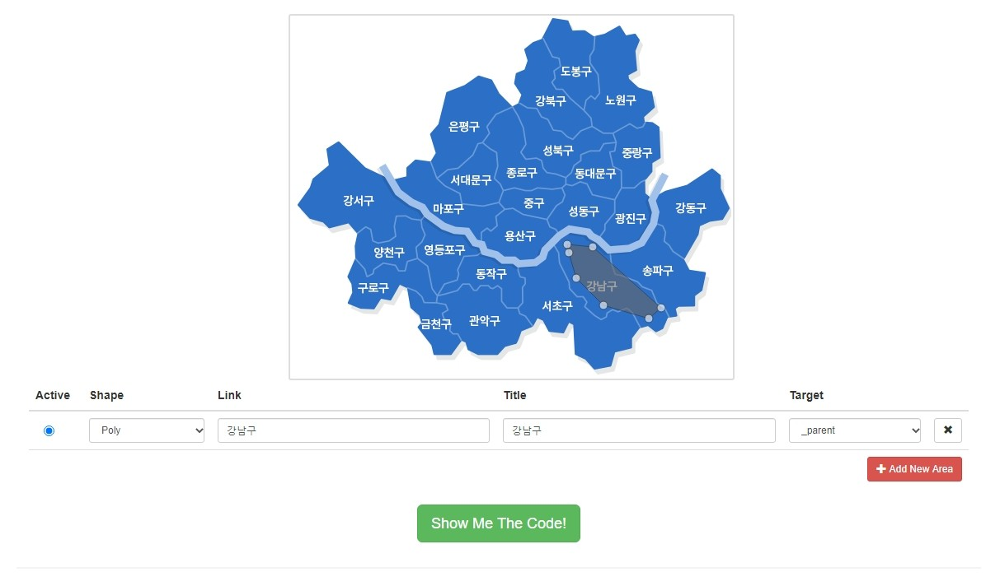
  - 이렇게 영역을 잡을 수 있다. 25개 모든 지역을 위와 같이 처리를 한다. 그 다음 Show Me The Code를 클릭한다.
  - 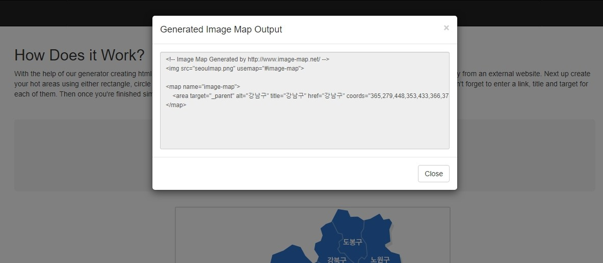
  - 그러면 이렇게 html 코드로 변환해서 보여준다. 이거를 복사해서 장고 html 파일에 붙여준다.

#### 지역선택 -> 강남구

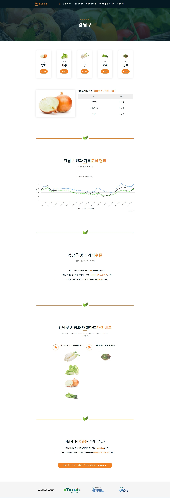

- 우리가 분석한 파일을 csv로 저장해서 장고에서 불러온 후 웹 페이지에 표현해주었다.

#### 채소별 싼 곳 비싼 곳

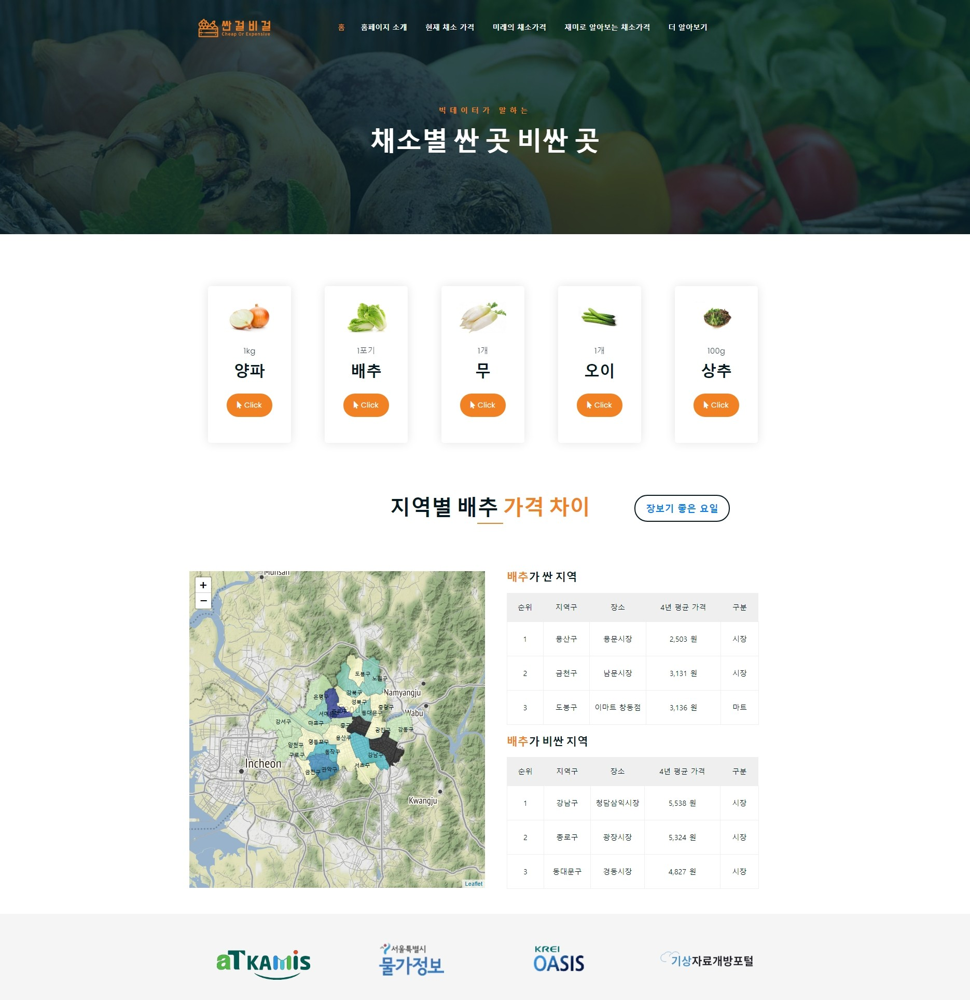

- 폴리엄으로 만든 지도를 스크립트로 붙여서 함수로 감싸고 비동기 방식으로 id를 호출하였다.

#### 채소가격 변동시기

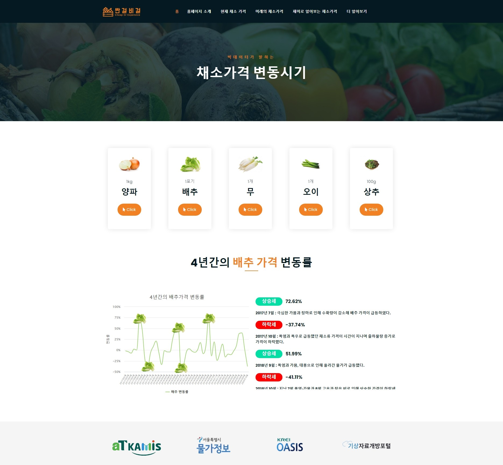

- 해당 값이 있는 부분에 옵션을 주어야 하는데 옵션 자체를 데이터로 만들어서 불러왔다.

#### 미래의 채소가격

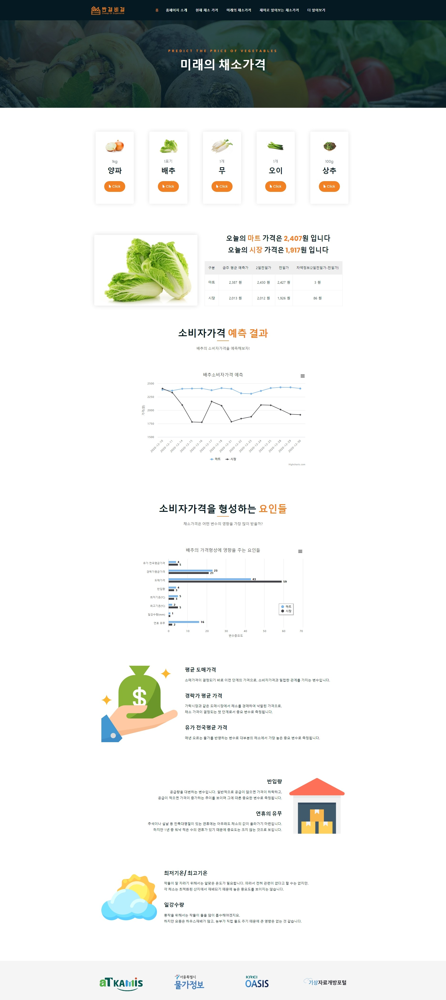

- 미래의 채소 가격도 강남구와 똑같이 분석한 데이터를 csv로 불러와서 화면에 표현하였다.

#### 재미로 알아보는 채소가격

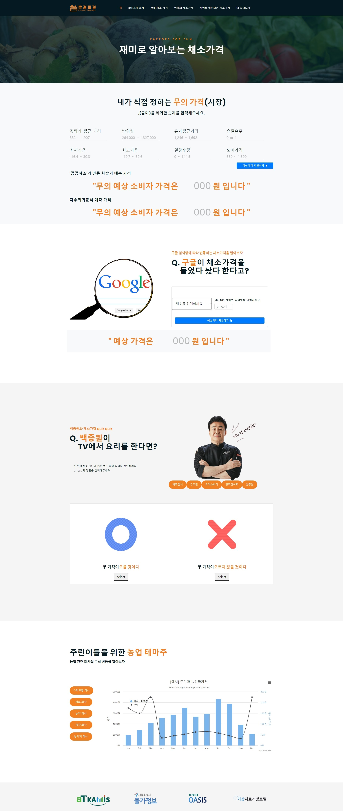

- 우리 조가 만든 예측기를 사용하여 입력된 값을 view에 보내고 거기서 예측기를 돌려서 다시 html로 보내는 방식을 사용하였다. 나머지도 분석한 결과를 html에 표현하였다.

#### 유통

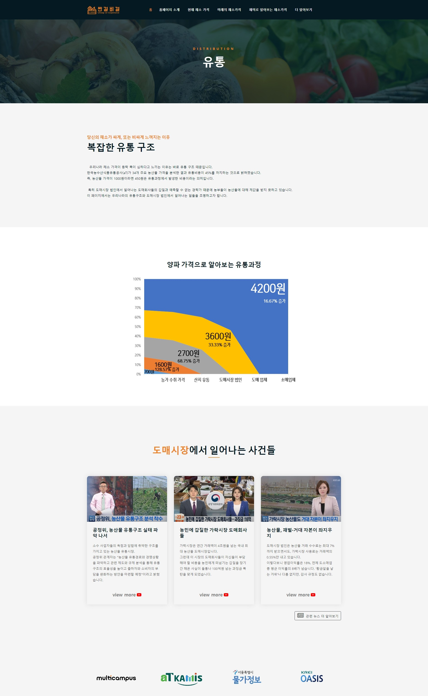

- 비디오는 모달로 표현하였다.

#### News Article

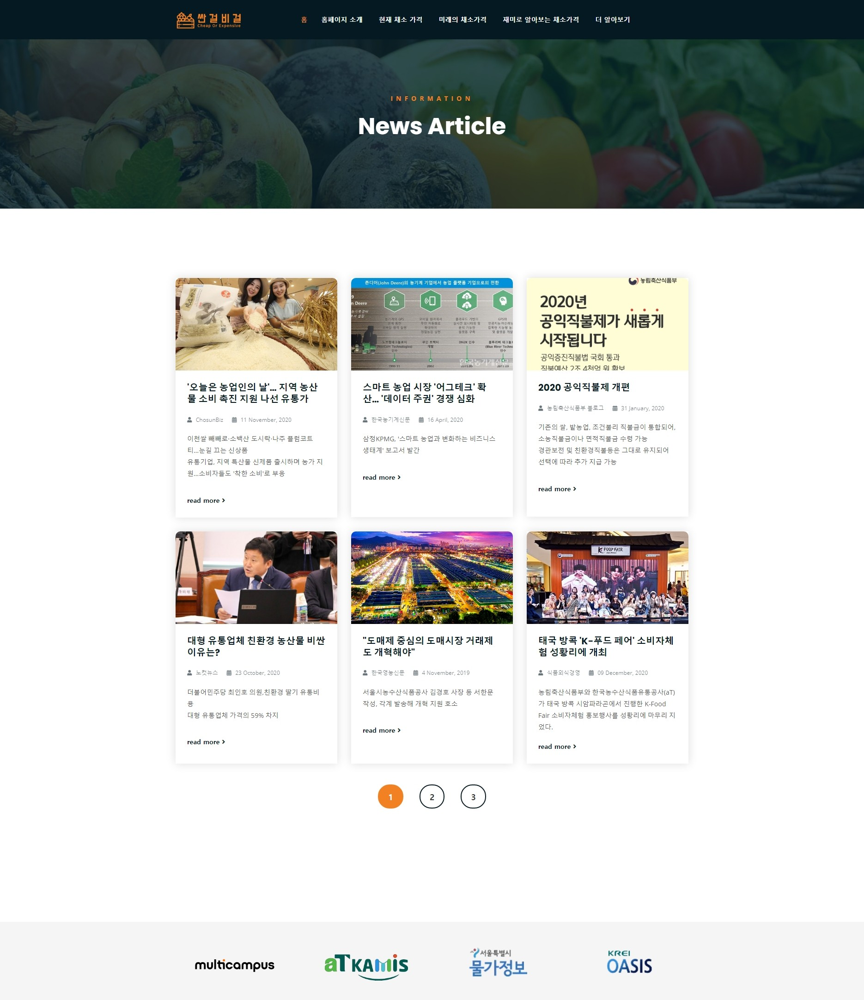

#### 마트 • 시장 지도

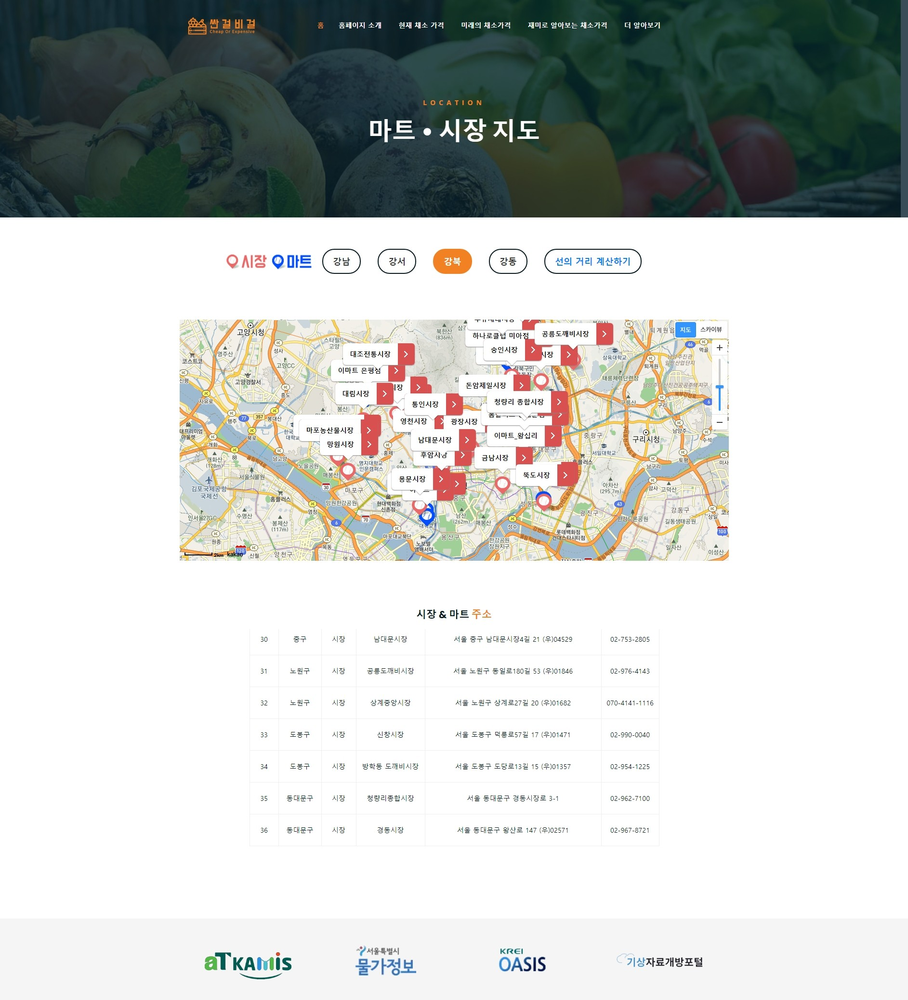

- 카카오맵 API를 사용하여 지도를 표시하였다.
- 지도, 마트 위도와 경도를 구글에서 찾아 좌표 하니씩 모두 입력하였다.
- 밑에 시장, 마트 주소도 구글에서 찾아 ajax로 만들었다.